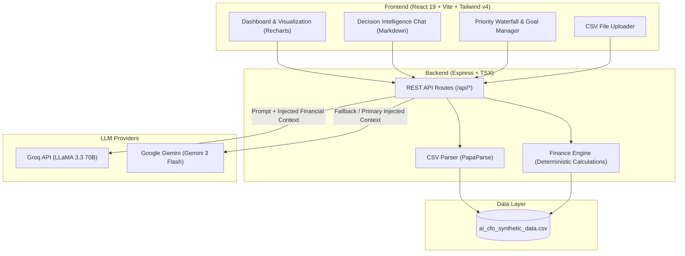

# 🪙 AI Personal CFO (Proof of Concept)

> **A Personal Financial Decision Intelligence System** providing predictive insights, proactive risk alerts, scenario simulations, and priority waterfall budget allocation.

[](https://react.dev/)
[](https://www.typescriptlang.org/)
[](https://vitejs.dev/)
[](https://tailwindcss.com/)
[](https://expressjs.com/)
[](https://ai.google.dev/)
[](https://groq.com/)

---

## 📌 Table of Contents

- [Overview](#-overview)
- [Key Features](#-key-features)
- [How It Works](#-how-it-works)
- [System Architecture](#-system-architecture)
- [Tech Stack](#-tech-stack)
- [Personas & Dataset](#-personas--dataset)
- [Getting Started](#-getting-started)
  - [Prerequisites](#prerequisites)
  - [Installation](#installation)
  - [Configuration](#configuration)
  - [Running the Application](#running-the-application)
- [API Endpoints](#-api-endpoints)
- [Example AI Chat Prompts](#-example-ai-chat-prompts)
- [Available Scripts](#-available-scripts)
- [Roadmap](#-roadmap)
- [License](#-license)

---

## 💡 Overview

Traditional personal finance apps are primarily **backward-looking**—they show what you've already spent, generate static pie charts, and provide generic advice.

**AI Personal CFO** is a **forward-looking decision intelligence system** designed to act as your virtual Chief Financial Officer. It bridges deterministic financial accounting with generative AI:
- Computes deterministic cash flows, savings surplus, and fixed obligation calendars to prevent math hallucinations.
- Injects grounded financial context into LLMs (Google Gemini / Groq LLaMA) for intelligent, proactive scenario simulations and risk analysis.
- Automatically prioritizes savings and debt using a **Priority Waterfall Allocation** model.

---

## 🚀 Key Features

### 1. 🧮 Deterministic Financial Engine
- **Accurate Ledger Aggregations**: Computes actual income, fixed/discretionary expenses, monthly surplus, and end-of-day balances from raw transaction data.
- **Fixed Obligation Timeline**: Automatically detects recurring commitments (Housing, Utilities, Subscriptions, Education, Debt) and maps their due dates.
- **Proactive Risk Alerts**: Issues real-time warnings if current liquidity cannot cover upcoming obligations due before month-end.
- **Indian Micro-Trends & Seasonality**: Factors in contextual adjustments like summer electricity surges (April–May), Diwali festive spending multipliers (October–November), and March tax-saving (ELSS) reminders.
- **3-Month Balance Forecasting**: Projects end-of-month balances based on moving averages and seasonal multipliers.

### 2. 🎯 Priority Waterfall Goal Allocation
- Allocates available monthly surplus across multiple financial goals according to strict priority rankings (Priority 1 = Highest, Priority 5 = Lowest).
- Supports dynamic addition of new goals (e.g., *Emergency Fund*, *New Laptop*, *Manali Trip*, *Tax Reserve*).
- Real-time visualization of goal completion percentages and allocated funds.

### 3. 💬 Decision Intelligence Chat (AI Advisor)
- **Zero Hallucination Arithmetic**: Grounded in pre-calculated engine metrics, guaranteeing mathematical accuracy.
- **"Can I Afford This?" Purchase Simulation**: Evaluates discretionary purchases against remaining fixed obligations and generates a safety risk score (1–10).
- **Dual AI Engine Support**:
  - **Groq SDK** (`llama-3.3-70b-versatile`) for ultra-low latency responses.
  - **Google Gemini** (`gemini-3-flash-preview` / `@google/genai`) for deep contextual reasoning.

### 4. 👥 Multi-Persona Simulation
Includes 5 pre-built real-world personas with distinct spending habits, incomes, and lifestyle dynamics:
- 🎓 **Bhavesh (Intern / Fresher)**: Entry-level stipend, PG rent, food delivery, and entertainment subscriptions.
- 💼 **Gokul (Salaried Bachelor)**: Stable monthly salary, lifestyle expenses, rent, and utility bills.
- 💻 **Virendra (Freelancer)**: Variable cash flows, tax provisioning, and project-based revenue.
- 👨‍👩‍👧 **Aniket (Married Professional)**: Family expenses, school fees, insurance, and long-term goals.
- 🌍 **Pratik (Remote Worker)**: Home office expenses, subscriptions, and travel flexibilities.

### 5. 📂 Custom CSV Dataset Ingestion
- Upload your own transaction statements directly from the web interface.
- Instant parsing and real-time refresh of financial dashboards and forecasts.

---

## 🏗 System Architecture



---

## 🛠 Tech Stack

| Domain | Technology | Description |
| :--- | :--- | :--- |
| **Frontend** | [React 19](https://react.dev/) | Modern component architecture with concurrent rendering |
| **Styling** | [Tailwind CSS v4](https://tailwindcss.com/) | High-performance CSS framework with dark theme palette |
| **Animations** | [Motion](https://motion.dev/) | Fluid animations for modal dialogs and alert cards |
| **Charts** | [Recharts](https://recharts.org/) | Responsive SVG charts for 3-month balance forecasting |
| **Icons** | [Lucide React](https://lucide.dev/) | Clean, accessible icon set |
| **Server** | [Express](https://expressjs.com/) + [TSX](https://github.com/privatenumber/tsx) | Node.js TypeScript server with Vite middleware integration |
| **Data Parser** | [PapaParse](https://www.papaparse.com/) | Robust CSV stream parser for transaction ledgers |
| **File Handling** | [Multer](https://github.com/expressjs/multer) | Multipart file upload middleware |
| **AI / LLMs** | [Google GenAI SDK](https://www.npmjs.com/package/@google/genai) | Gemini 3 Flash model integration |
| **AI / LLMs** | [Groq SDK](https://www.npmjs.com/package/groq-sdk) | LLaMA 3.3 70B Versatile model integration |

---

## 📊 Dataset Schema (`ai_cfo_synthetic_data.csv`)

The CSV ledger utilizes the following structure:

| Column Name | Data Type | Description | Example |
| :--- | :--- | :--- | :--- |
| `Full_Date` | `DD-MM-YYYY` | Transaction date | `01-10-2025` |
| `Person` | `string` | Persona identifier | `Bhavesh (Intern/Fresher)` |
| `Transaction_Description` | `string` | Line-item description | `PG Rent/Mess` |
| `Category` | `string` | Spending or revenue classification | `Housing`, `Income`, `Food & Dining`, `Tech` |
| `Value` | `number` | Transaction amount (+ for income, - for expense) | `-6000` or `15000` |
| `Total_Exp_Month_Counter`| `number` | Cumulative expenses for the current month | `6000` |
| `EOD_Balance` | `number` | End of Day running bank balance | `14000` |

---

## ⚡ Getting Started

### Prerequisites

- **Node.js** (version 18.x or higher)
- **npm** or **pnpm** / **yarn**
- An API Key for **Google Gemini** ([Google AI Studio](https://aistudio.google.com/)) or **Groq** ([Groq Console](https://console.groq.com/))

---

### Installation

1. **Clone the repository:**
   ```bash
   git clone https://github.com/Virendra108/AI-Personal-CFO-POC.git
   cd AI-Personal-CFO-POC
   ```

2. **Install dependencies:**
   ```bash
   npm install
   ```

---

### Configuration

Create a `.env` file in the root directory (or use `.env.local`):

```env
# AI Service Keys (Provide at least one)
GEMINI_API_KEY="your_google_gemini_api_key_here"
GROQ_API_KEY="your_groq_api_key_here"

# Optional Server Port (Defaults to 3000)
PORT=3000
```

> **Note**: The backend checks for `GROQ_API_KEY` first. If absent or unset, it falls back to `GEMINI_API_KEY`.

---

### Running the Application

Start the full-stack development server:

```bash
npm run dev
```

Open your browser and navigate to:
```
http://localhost:3000
```

---

## 📡 API Endpoints

### 1. `GET /api/insights`
Fetches comprehensive deterministic insights for a persona.
- **Query Parameter**: `person` (e.g., `Bhavesh`, `Virendra`, `Gokul`)
- **Response**:
  ```json
  {
    "currentBalance": 4716.36,
    "monthlyIncome": 15000,
    "monthlyExpenses": 15283.64,
    "surplus": -283.64,
    "upcomingFixedExpenses": [
      { "category": "Housing", "amount": 6000, "dueDate": "02" },
      { "category": "Subscription", "amount": 59, "dueDate": "15" }
    ],
    "riskAlerts": [
      "CRITICAL: Your current balance (₹4716.36) is less than your upcoming fixed expenses..."
    ],
    "forecast": [
      { "month": "Nov", "balance": 4433 },
      { "month": "Dec", "balance": 4149 },
      { "month": "Jan", "balance": 3866 }
    ],
    "goals": [
      { "id": "1", "name": "Emergency Fund", "targetAmount": 50000, "savedAmount": 15000, "priority": 1, "category": "Safety" }
    ],
    "waterfallAllocation": [
      { "goalName": "Emergency Fund", "allocatedAmount": 2500 }
    ]
  }
  ```

### 2. `POST /api/chat`
Conversational financial advisory with context injection.
- **Request Body**:
  ```json
  {
    "person": "Bhavesh (Intern/Fresher)",
    "message": "Can I afford to purchase noise-canceling headphones for ₹4,500?"
  }
  ```
- **Response**:
  ```json
  {
    "text": "### ⚠️ Purchase Simulation & Risk Alert\nBuying these headphones for **₹4,500** is **High Risk (Risk Score: 8/10)**..."
  }
  ```

### 3. `POST /api/goals`
Add a new financial goal to the persona's Priority Waterfall.
- **Request Body**:
  ```json
  {
    "person": "Virendra (Freelancer)",
    "goal": {
      "name": "New Mechanical Keyboard",
      "targetAmount": 12000,
      "priority": 2,
      "category": "Tech"
    }
  }
  ```

### 4. `POST /api/upload`
Upload a multipart CSV file (`multipart/form-data`) under the `file` field to replace the active dataset.

---

## 💬 Example AI Chat Prompts

Try asking the CFO these questions in the app:

| Scenario | Example Prompt |
| :--- | :--- |
| **Affordability Check** | *"Can I afford to buy a new gaming monitor for ₹18,000 this month?"* |
| **Cash Crunch Warning** | *"Do I have enough balance left to cover my rent and subscription bills due next week?"* |
| **Waterfall Goal Strategy** | *"How is my monthly surplus being split between my Emergency Fund and Laptop goals?"* |
| **Seasonal Trends** | *"How will upcoming summer utility expenses or festive shopping impact my 3-month savings?"* |

---

## 📜 Available Scripts

| Command | Description |
| :--- | :--- |
| `npm run dev` | Starts Express server with Vite middleware on `http://localhost:3000` |
| `npm run build` | Compiles frontend assets into the `dist/` production folder |
| `npm run preview` | Previews the production build locally via Vite |
| `npm run lint` | Runs TypeScript type checking (`tsc --noEmit`) |
| `npm run clean` | Cleans up the `dist/` directory |

---

## 🗺 Roadmap

- [ ] **Open Banking / Account Aggregator API Integration**: Real-time bank account syncing (e.g., Setu, Finvu).
- [ ] **Automated Categorization with NLP**: Auto-tagging unclassified bank transactions.
- [ ] **Multi-Currency Support**: Dynamic currency switching (₹ INR, $ USD, € EUR, £ GBP).
- [ ] **Exportable Financial Reports**: Downloadable monthly PDF/Excel CFO digests.
- [ ] **Custom Scenario Sandboxing**: Interactive sliders to simulate pay raises, rent increases, or sudden medical emergencies.

---

## 📄 License

This project is open-source and available under the [MIT License](LICENSE).
